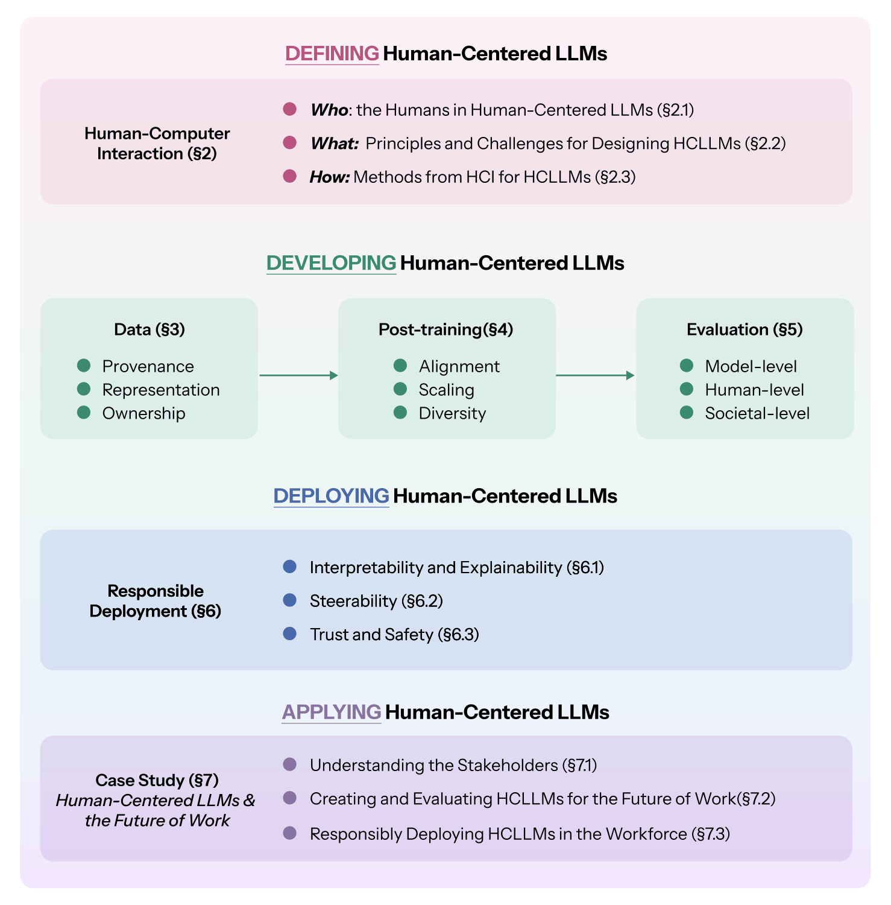

**Figure.** This survey has three core sections, focused on (1) defining, (2) developing, and (3) deploying human-centered LLMs (HCLLMs). In the first section, we conceptualize human-centeredness through HCI ([HCI for HCLLMs](../02-hci/)) (who, what, and how). In the second, we illustrate how these principles appear across the LLM development pipeline ([Data for HCLLMs](../03-data/), [NLP for HCLLMs](../04-nlp/), [Evaluation](../05-evaluation/)), and finally discuss considerations for deploying HCLLMs in a responsible manner ([Responsible Human-Centered LLMs](../06-responsible/)). Finally, we synthesize takeaways from the three core sections into a case study on the deployment of HCLLMs for the future of work ([Case Study: HCLLMs and the Future of Work](../07-applications/)).

Large Language Models (LLMs) have transitioned from research artifacts to production infrastructure. They now power developer tools, enterprise copilots, search and recommendation systems, content moderation pipelines, and domain-specific assistants across healthcare [@thirunavukarasu2023large], finance [@xie2024finben; @nie2024survey], education [@gan2023large; @adiguzel2023revolutionizing; @wang2024largelanguagemodelseducation], science [@si2024llmsgeneratenovelresearch; @zhang2024comprehensive] and law [@li2025legalagentbench; @katz2024gpt; @guha2024legalbench]. As LLMs are integrated into individual and collective processes, they can no longer be understood as isolated tools bounded by static performance metrics or leaderboard positions. LLMs are sociotechnical systems with global influence, and should be developed and evaluated in starkly more human terms. Are these models helpful, steerable, and safe under adversarial pressure, aligned across global markets, robust to distribution shift, and adaptable to evolving user goals and expectations? Do models comply with data governance regimes, privacy regulations, and ethical concerns around intellectual property? How can we build models that not only avoid harm but also actively contribute to human flourishing? Can LLMs do more than just passively assist humans; can they also actively collaborate with us as equal partners?

This survey advances the framework of Human-Centered Large Language Modeling (HCLLMs) as a unifying lens for understanding and answering these questions. Rather than treating human-centered objectives as simple patches or alignment problems downstream of capability scaling, we argue that human-centered methods must be embedded across the entire LLM development pipeline, from data sourcing and filtering, to post-training and alignment, evaluation, deployment, and long-term maintenance (see the figure).

Importantly, we will demonstrate how human-centered objectives tend to resist universal solutions. The optimal path will depend both on who you ask and how you operationalize concepts like *harm* and *benefit*. Broad themes like *transparency*, *privacy*, *safety*, and *justice* frequently emerge [@jobin2019global], but there will be significant variation in perspective on how these ideals should be implemented [@awad2018moral; @jobin2019global]. Governments and non-profit organizations may codify the most dominant perspectives into laws and policies [@jobin2019global], but high-level guidelines may fail to account for the nuances of real-world use [@hagendorff2020ethics], and lag behind the rapid evolution of language models themselves [@auernhammer2020human]. In the face of these challenges, stakeholders often remain passive, which only endorses the status-quo [@kalluri2020don; @crawford2021atlas; @birhane2022values].

This survey paper elaborates on and endorses the alternative, Human-Centered Design [@capel2023human] (HCD), where users and other stakeholders are *centrally* involved with ideating, building, evaluating, and deploying Large Language Models [@shneidermanHumanCenteredArtificialIntelligence2020; @shneidermanHumanCenteredAI2022]. Their centrality at every stage of the design process is what distinguishes HCD from other instantiations of human factors design [@xu2019toward] that account for general user needs (e.g., *transparency*) in only a small slice of the design or deployment process [@auernhammer2020human]. LLM development rarely *centers* humans, but there is a growing body of research from Natural Language Processing (NLP) and Human-Computer Interaction (HCI) that points towards these ideals. We will cover this foundation for *HCLLMs* in an in-depth survey of relevant human factors approaches in **HCI** ([HCI for HCLLMs](../02-hci/)) and **NLP** ([NLP for HCLLMs](../04-nlp/)), including more details on the **Data Pipeline** ([Data for HCLLMs](../03-data/)), and the **Evaluation** ([Evaluation](../05-evaluation/)) of LLMs. With this foundation established, we will return to the principle axes of **Responsible and Ethical Deployment** ([Responsible Human-Centered LLMs](../06-responsible/)), like *transparency*, *privacy*, and safety. Synthesizing our discussion across these prior chapters, we will conclude with a concrete **Case Study** ([Case Study: HCLLMs and the Future of Work](../07-applications/)) on the considerations of *HCLLMs* for the future of work.
