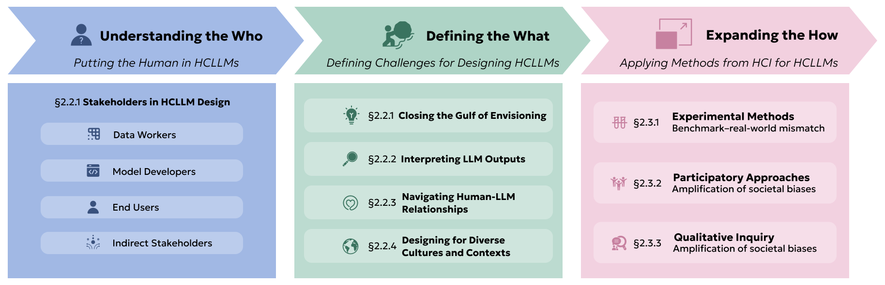

How do we center humans in the design of LLMs? To start, we can turn to the field of human-computer interaction (HCI), which offers the foundational principles for realizing the vision of HCLLMs. In particular, HCI provides the established theories, methods, and frameworks for understanding and designing the critical interface between the human user and the complex system (see the figure). This field has long grappled with how to make technology not just functional, but also usable, understandable, and aligned with human values and needs.

In the first subsection of this chapter, we start by tracing how principles of ***human-centered design*** apply to HCLLMs and understanding *who* are the stakeholders for designing HCLLMs ([Understanding the Who](../02-hci/01-understanding-the-who-the-humans-in-hcllms)). We then discuss ***design principles and challenges*** for creating HCLLMs in [Defining the What](../02-hci/02-defining-the-what-principles-and-challenges-for-designing-hcllms). These challenges range in scope from the individual level (i.e., how we can improve end-user interactions with these models) to the societal level (i.e., how to account for the diverse cultures and contexts in which these models will be deployed). We then discuss how HCI ***methodologies*** can be used in conjunction with techniques commonly used in NLP to build and evaluate HCLLMs. We conclude in [Expanding the How](../02-hci/03-expanding-the-how-methods-from-hci-for-hcllms) with an overview of three methodological orientations—experimental methods, participatory approaches, and qualitative inquiry—from HCI and discuss how they can be adopted for HCLLMs.

**Figure.** We can draw on the field of human-computer interaction (HCI) to help inform human-centered LLM design. The first in this process is understanding *who* the relevant stakeholders are—both direct and indirect—in both the development and deployment of HCLLMs [Understanding the Who](../02-hci/01-understanding-the-who-the-humans-in-hcllms). Second, we identify a set of unique interaction challenges when it comes to designing HCLLMs [Defining the What](../02-hci/02-defining-the-what-principles-and-challenges-for-designing-hcllms). Finally, we discuss how HCI methods can be used for providing new design perspectives [Expanding the How](../02-hci/03-expanding-the-how-methods-from-hci-for-hcllms). We synthesize these points in a case study on designing LLMs for motivating physical activity in [Case Study: Motivating Physical Activity with HCLLMs](../02-hci/04-from-human-centered-design-challenges-to-technical-artifacts).
