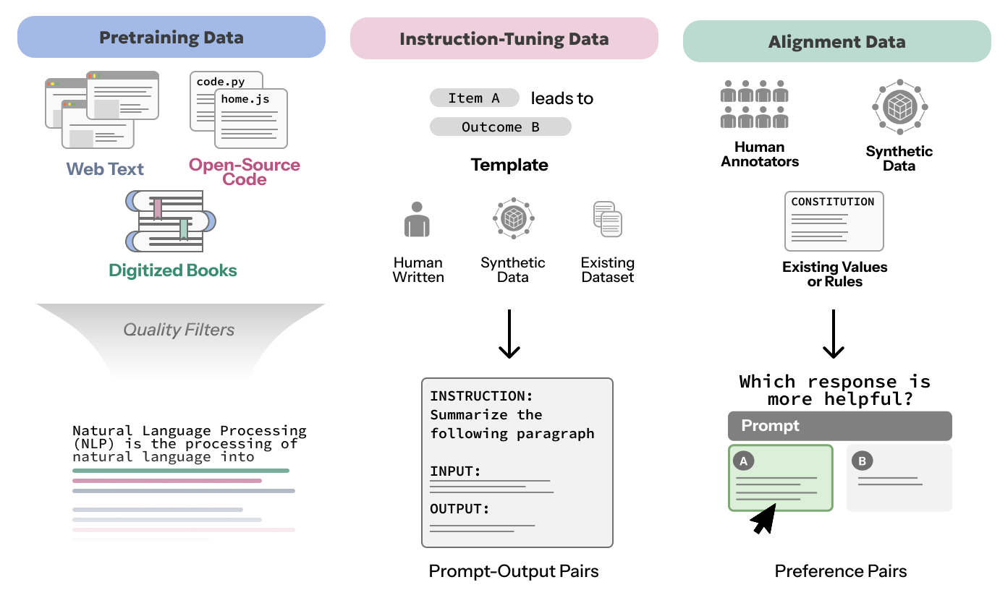

**Figure.** This chapter focuses on the human origins of data ([Data Provenance](../03-data/01-data-provenance)), and how data encodes perspectives and values that impact HCLLM outcomes, from representation and bias ([Data Representation, Bias and Ethics](../03-data/02-data-representation-bias-and-ethics)) to consent and ownership ([Consent and Ownership](../03-data/03-consent-and-ownership)). In particular, we consider ***pre-training data***, ***instruction-tuning data***, and ***alignment data***.

**Data provenance** [@longpredata], also called **dataset genealogy** [@denton2021genealogy], is the record of a dataset's origins, history, and transformations throughout its lifecycle. An understanding of data provenance is critical for achieving transparency in LLM development [@bommasani2023transparency]. Without transparent data practices, it becomes difficult to predict and understand why LLMs leak private information [@19_kandpal2022deduplicating; @bubeck2023sparksartificialgeneralintelligence], violate copyrights [@carlini2021extracting], or perpetuate social biases [@denton2021genealogy]. But with data provenance, stakeholders become more equipped to audit models [@mokander2024auditing] and tackle these human-centered concerns. In this section, we will investigate the provenance of data used for pre-training, instruction-tuning, and aligning LLMs. In particular, we ask where data comes from, who produced it, and under what conditions it was produced.

## Pretraining Data

**Data Sources.** The provenance of LLM pretraining data is often complex, layered, and opaque. Unlike the small, curated datasets of traditional machine learning, LLM pretraining corpora tend to be huge, multi-trillion token aggregations across heterogeneous and potentially noisy sources. These sources traditionally include web text, digitized books, and open-source code repositories [@wenzek2019ccnetextractinghighquality; @raffel2020exploring; @soldaini2024dolmaopencorpustrillion; @devlin-etal-2019-bert]. Although different model developers use different data mixtures, most incorporate an open web crawl that at least partially intersects the [*Common Crawl*](https://commoncrawl.org/). The Common Crawl contains monthly snapshots of "open web"—partial samples of machine-crawlable sites reached from seed URLs that were initially crowdsourced in 2008 [@baack2024critical]. This is not a random sample of the internet. Large web crawls like this favor wikis, news sites, blogs, and other user-generated content platforms, which are generally multilingual, but heavily skew towards English [@baack2024critical]. Much of this data has been found to be socially undesirable, with a high prevalence of hate speech and sexually explicit content [@luccioni2021whatsboxpreliminaryanalysis]. The data can also reify social, cultural, and political biases [@naous2024havingbeerprayermeasuring; @feng2023pretrainingdatalanguagemodels; @navigli2023biases]. Finally, this web-scale data inextricably encodes the structural biases of the web itself, where the majority of content is produced by an active minority of users, and these users overly represent Western, Educated, Industrialized, Rich and Democratic (WEIRD) populations [@baeza2018bias].

**Quality Filtering.** Because open web data is noisy, redundant, low-quality, and often socially undesirable, model developers use classifiers or heuristics [@chen2021evaluatinglargelanguagemodels; @penedo2023refinedweb; @rae2021scaling; @soldaini2024dolmaopencorpustrillion] to filter their pre-training corpora for unique and high-quality documents that are information dense and free from toxicity or personally identifiable information [@longpre2024responsible]. By filtering pre-training data in this way, researchers can train safer models with better performance at lower computational costs [@du2022glamefficientscalinglanguage; @rae2021scaling; @albalak2024dataselection]. The distributions of these filtered corpora are shaped by sampling decisions, including the filters used to determine document quality. These quality filters often systematically exclude both communities and discursive topics [@lucy-etal-2024-aboutme]. For instance, toxicity classifiers often exhibit racial and linguistic bias [@sap2019risk; @dodge-etal-2021-documenting]. Quality filters trained on Wikipedia and OpenWebText tend to favor text from wealthy, educated, urban areas [@gururangan-etal-2022-whose].

After language identification [@conneau2019cross; @laurenccon2022bigscience] and deduplication [@lee2022deduplicatingtrainingdatamakes], model-based filtering is one popular quality filtering approach. For example, perplexity-based methods filter noisy documents that appear as highly surprising to a much smaller language model. CCNet [@wenzek2019ccnetextractinghighquality] was constructed as a subset of the Common Crawl, filtered with 5-gram language models that the authors trained on Wikipedia data for each target language. They use a fastText classifier [@joulin2017bag] for language identification and run each deduplicated document through the appropriate 5-gram model to compute perplexity, filtering based on a heuristic and language-specific perplexity threshold. Disconcertingly, this pipeline effectively filters out minority dialects and low-resource languages [@albalak2024dataselection] for which language ID is unreliable [@caswell-etal-2020-language; @kudugunta2023madlad], or the perplexity model is overfit to only a small corpus [@feng2023pretrainingdatalanguagemodels; @lucy-etal-2024-aboutme]. Perplexity-based filtering will retain text that matches the language distribution the filtering model was fit to. When the standard is Wikipedia, filtering will primarily preserve Standard American English in the third person, written in a neutral, semi-formal and broadly readable register, with clear declarative sentences. Another idea is to prompt existing LLMs to estimate the quality of pre-training data zero-shot using some manually-written definition of high quality data [@sachdeva2024train; @wettig2024qurating; @penedo2024fineweb]. This was the approach used for Llama-3 [@llama3modelcard]. However, manually-written definitions are brittle and may not encompass task-specific or user-specific notions of LLM utility [@held2025optimizing]. A third idea is to fine-tune a small model like fastText [@joulin2017bag] as a binary quality classifier. The binary classifier was the approach used by DataComp for Language Models [DCLM; @li2024datacomp], as this resulted in models with higher scores on general benchmarks like MMLU [@hendrycksMMLU2021]. However, methods like this are prone to overfitting on the training set, the construction of which itself reflects and reifies the values of model developers.

Another popular filtering mechanism is to use content heuristics like domain name blacklists, and toxic keyword dictionaries, which were used to construct the Colossal Clean Crawled Corpus (C4) [@xue2021mt5; @raffel2020exploring]. The English C4 was found to skew heavily towards Wikipedia articles, patents, and United States news articles, such as the New York Times [@dodge-etal-2021-documenting; @elazar2024s]. Most documents in the corpus had been published after the year 2011. The multilingual variant, mC4 [@xue2021mt5], represents 101 identified languages, but many of these languages are under-represented [@snaebjarnarson2022warm]. For example, compared to 2.7T tokens of English, mC4 contains only 600,000 tokens of Javanese [@aji2022one]. Data for these lower-resource languages is also much noisier than that of the English subset [@kreutzer2022quality; @van2024language].

Many pretraining corpora aggregate documents from a variety of sources. Popular examples include the Pile [@gao2020pile800gbdatasetdiverse], RedPajama [@weber2024redpajama], and Nemotron-CC [@su2025nemotron], which contain 300B, 1T, and 7T tokens respectively, sampled from the Common Crawl, as well as academic texts, books, coding, medical, and legal documents [@biderman2022datasheet; @weber2024redpajama]. Over half of the documents in these data mixes are duplicated at least once, and some of these contain personally identifiable information like email and IP addresses, as well as toxic language [@elazar2024s].

## Instruction-tuning Data

Compared to the origin story of pre-training data, the provenance of instruction-tuning datasets is relatively well-known. Data is typically aggregated by a single organization for the purpose of fine-tuning a model to follow instructions. Therefore the provenance of instruction dataset development resembles the distribution of model developers, over half of whom originate in the US or China [@held2023material]. Notable examples include Google's FLAN [@chung2024scaling], AI2's Natural Instructions [@mishra2021crossnaturallanguage], Stanford's Alpaca [@alpaca], and Cohere's Aya corpus [@singh2024aya].

The instruction aggregation process often involves selecting a diverse range of tasks over which are constructed well-formatted prompt-output pairs. Some organizations may opt to annotate these pairs entirely from scratch, like in the @databricks2023dolly15k Dolly-15k. There are ethical and scientific benefits in such cases where data is sourced with explicit consent, attribution, and compensation. However, this is not the norm, especially since doing so demands significant human labor.

In many cases, instructions are sourced automatically from evaluation benchmarks via templates [@chung2024scaling; @longpre2023flan], which may be further translated [@muennighoff2022crosslingualBLOOMZ] or restructured using tertiary models. The templates themselves typically have a human origin. For example, the Natural Instructions dataset [@mishra2021crossnaturallanguage] was sourced from annotation guidelines that the benchmark developers constructed to onboard crowdworkers. Sometimes, humans also write templates from scratch, especially in the early days of UnifiedQA [@khashabi2020unifiedqa] and FLAN [@wei2021finetuned], and in low-resource settings like the multi-lingual Aya corpus [@singh2024aya]. However, much of the data construction pipeline is automated. This trend is growing as instruction-tuning datasets are generated synthetically. For example, the instructions used to fine-tune Stanford's Alpaca model [@alpaca] were distilled from GPT-3.5, a larger model which was itself instruction-fine-tuned. This approach, called self-instruction tuning [@wang2023selfinstructaligninglanguagemodels], has been adopted in a range of more recent work [@peng2023instructiontuninggpt4; @li2023ottermultimodalmodelincontext]. As we will discuss in [Expanding Data Sources: Synthetic and Non-Traditional Data](../03-data/04-expanding-data-sources-synthetic-and-non-traditional-data), the use of synthetic data for self-instruction tuning complicates data provenance, and may exacerbate the human-centered concerns raised in this chapter.

## Alignment Data

Additional datasets are used for *model alignment*, or the process of training more helpful and less harmful models via supervised fine-tuning, preference tuning, and reinforcement learning from human feedback (RLHF) [@askell2021generallanguageassistantlaboratory]. Since alignment data is what produces models that are useful to humans, it constitutes a major force behind the sudden proliferation in the number of LLM users worldwide.

Since the notion of helpfulness or harmfulness is ambiguous and varies with different cultures and contexts, one might expect a commensurate heterogeneity in both the source and format of alignment data [@ethayarajh2024behavior]. This is generally not the case. With respect to the format, many alignment datasets assume a Bradley--Terry model of pairwise human preferences. Datasets like Anthropic's HH-RLHF [@bai2022traininghelpfulharmlessassistant], OpenAI's InstructGPT [@ouyang2022training], and Peking University's PKU-SafeRLHF [@NEURIPS2023_4dbb61cb] couple a user prompt with a pair of model responses: one preferred and one dispreferred. With respect to data sources, many preference judgments come from a very small pool of annotators, sometimes within the organization itself. For example, Peking University hired 28 internal annotators to construct PKU-SafeRLHF, and Anthropic's internal research team similarly hired and trained a small group of contractors to construct HH-RLHF.

Crowdsourcing and citizen science can serve to democratize the process of collecting alignment data. One drawback of these approaches is sampling bias, which may favor researchers, AI enthusiasts, and individuals from industrialized nations. Chatbot Arena [@DBLP:conf/icml/ChiangZ0ALLZ0JG24], also known as LMArena, is one example of a public web platform with open-user participation in which volunteers engage with pairs of anonymous models and provide preference feedback in the standard binary format. The project was initiated at the University of California Berkeley in 2023, and covers 96 languages, although the vast majority are in English. OpenAssistant Conversations [@kopf2023openassistant] is a similar crowdsourcing effort, initiated by the German non-profit LAION in 2022. Over 13k volunteers contributed alignment data in 35 different languages, particularly in English (50%), German (20%), and Spanish (10%). Of these annotators, 89.1% identified as male, with a median age of 26. These clear demographic biases above will skew the values, perspectives, and interests represented by this data.

To address issues of demographic bias, some dataset developers intentionally target underrepresented demographics in their recruitment efforts. For example, the PRISM Alignment Dataset [@kirk2024the] is an academic project initiated at the University of Oxford, where the developers recruited Prolific workers from 33 underrepresented countries. The Meta Community Alignment Dataset [@zhang2025cultivating] is a similarly-motivated multilingual preference dataset in which its 15k participants were recruited from five countries on YouGov. Still, there remain limitations in recruiting diverse populations from crowdwork platforms, which have limited global coverage [@rinderknecht2025daily; @douglasDataQuality; @palan2018prolific].

Synthetic data is an emerging trend among subsections in this chapter, and it is largely motivated by the need to scale AI beyond what human annotation labor can support [@casper2023openproblemsfundamentallimitations; @santurkar2023opinionslanguagemodelsreflect]. Some LLM developers have considered synthetic data in the alignment step as well. Variants of this approach include Constitutional AI [@Bai2022ConstitutionalAH] and Reinforcement Learning from AI Feedback [RLAIF; @lee2024rlaif]. Both approaches shift critical alignment decisions from data contributors to more centralized authorities: namely, the LLM-as-a-Judge, and those who prompt it. For example, in Constitutional AI, models judge their own output against the standards of a human-written constitution, and then re-write a better, constitution-aligned response. Anthropic's original 2022 constitution was sourced from Western liberal-democratic sources like the United Nations Declaration of Human Rights, the OECD, and Google's AI Principles. These frameworks employ individualist, rights-based moral reasoning [@haidt2012righteous], which may not represent other global ethical traditions, or incorporate the voices of pluralistic user bases [@sorensen2024roadmap].
