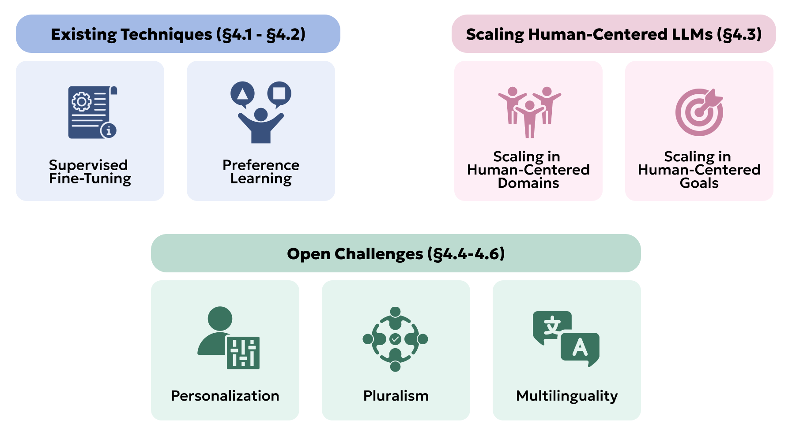

Human-centered LLMs are products of the multifaceted technical processes used to create them. NLP techniques determine not only what models can do but also the boundaries of what they *cannot*. These limitations can have particular consequences as users across diverse linguistic and cultural contexts interact with LLMs.

Prior survey papers cover the technical practicalities and details of NLP methods for LLMs [@minaee2024large; @zhao2023survey]. In this chapter, we instead focus on the human-centered considerations across the language model training pipeline. We have already discussed pre-training practices in [Data for HCLLMs](../03-data/) and will focus on ***post-training techniques*** in this chapter. Although post-training recipes differ across models, two core components include a supervised fine-tuning (SFT) stage ([Supervised Fine-tuning for HCLLMs](../04-nlp/01-supervised-fine-tuning-for-hcllms)) and a reinforcement learning stage that incorporates human preferences ([Learning from Human Preferences](../04-nlp/02-learning-from-human-preferences)). We next discuss how the predominant paradigm of scaling applies to human-centered objectives ([Scaling Human Centered LLMs](../04-nlp/03-scaling-human-centered-llms)). Finally, we conclude by discussing three currently open challenges and future research directions for HCLLMs, covering ***personalization ([Personalization](../04-nlp/04-personalization)), pluralistic alignment ([Pluralism](../04-nlp/05-pluralism)), and multilinguality ([Multilinguality](../04-nlp/06-multilinguality))***. For a roadmap, see the figure.

**Figure.** This chapter applies human-centered considerations to ***existing post-training techniques*** like SFT and RLHF ([Supervised Fine-tuning for HCLLMs](../04-nlp/01-supervised-fine-tuning-for-hcllms)-[Learning from Human Preferences](../04-nlp/02-learning-from-human-preferences)), and explores the limitations of ***scaling for human-centered outcomes*** ([Scaling Human Centered LLMs](../04-nlp/03-scaling-human-centered-llms)). Finally, we cover open challenges in ***personalization ([Personalization](../04-nlp/04-personalization)), pluralistic alignment ([Pluralism](../04-nlp/05-pluralism)), and multilinguality ([Multilinguality](../04-nlp/06-multilinguality))***.
