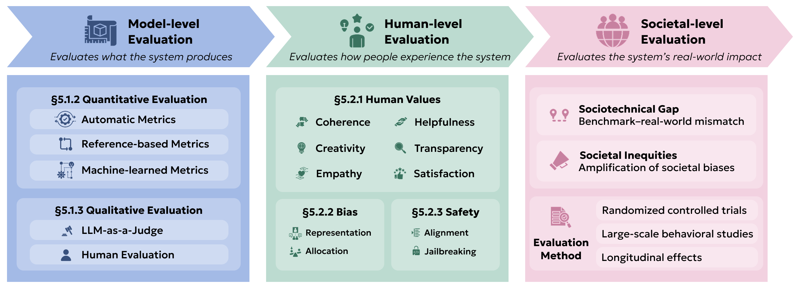

Evaluation methods allow model developers, users, and stakeholders to compare the capabilities and limitations of different LLMs, and to understand the scope of their utilities and risks in particular domains [@10.1145/3641289]. Evaluations can inform all stages of model development, from mixing pre-training data [@held2025optimizing; @mizrahi2025language] to selecting and optimizing reward models for alignment [@lambert2024rewardbenchevaluatingrewardmodels; @frick2024evaluate]. After models are trained, evaluations arguably become even more important. They act quality filters to decide whether and how companies deploy models [@liang2022holistic]. They inform researchers on the most important and promising directions for model improvement [@srivastava2022beyond], and help anticipate models' future capabilities [@kaplan2020scaling; @hoffmann2022training]. And finally, they shape public perceptions [@liao2022designing], and inform policy and other regulatory decisions [@eriksson2025can].

Without a human-centered evaluation of LLMs, model development, deployment, and governance may be oriented not towards the long-term and collective good, but rather towards profit incentives and short-term gains on surface-level heuristics [@eriksson2025can]. In this chapter, we observe common pitfalls and highlight best practices in human-centered evaluation, spanning three levels as shown in the figure. First, we consider evaluations at the level of model outputs ([Model-Level Evaluations](../05-evaluation/01-model-level-evaluations)), using both quantitative metrics ([Quantitative Evaluation](../05-evaluation/01-model-level-evaluations)) and qualitative evaluations ([Qualitative Evaluation](../05-evaluation/01-model-level-evaluations)). Beyond raw outputs, we also consider how people experience LLMs ([Human-Level Evaluations](../05-evaluation/02-human-level-evaluations)), considering human values ([Human Values](../05-evaluation/02-human-level-evaluations)), as well as concerns over bias ([Bias and Fairness Evaluation](../05-evaluation/02-human-level-evaluations)) and safety ([Safety Evaluations](../05-evaluation/02-human-level-evaluations)). Lastly, we discuss extrinsic evaluations at the societal level ([Societal-level Evaluation](../05-evaluation/03-societal-level-evaluation)), measuring the system's real world impact.

**Figure.** In this chapter, we discuss common pitfalls and best practices for evaluating HCLLMs, considering three distinct levels of evaluation: the model level ([Model-Level Evaluations](../05-evaluation/01-model-level-evaluations)), the human level ([Human-Level Evaluations](../05-evaluation/02-human-level-evaluations)), and the societal level ([Societal-level Evaluation](../05-evaluation/03-societal-level-evaluation)).
