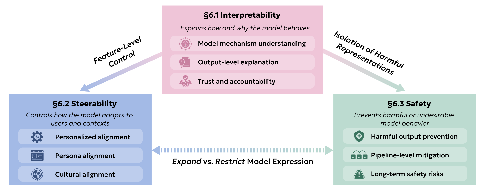

In this chapter, we highlight three broad properties that underpin a responsible deployment of HCLLMs, and we explore the tensions and relationships between these ideals (the figure). The first property is ***interpretability ([Interpretable and Explainable HCLLMs](../06-responsible/01-interpretable-and-explainable-hcllms))***: an HCLLM's input-output transformations should be understood. This property is first, since it complements our next two properties, ***steerability ([Steerable HCLLMs](../06-responsible/02-steerable-hcllms))*** and ***safety ([Safe HCLLMs](../06-responsible/03-safe-hcllms))***. Steerable models can be aligned along a pre-selected dimension, and safe models do not produce undesirable outputs. If we have an interpretable model, we may obtain a more steerable model through feature-level control, and we may obtain a safer model by isolating and removing harmful representations.

What makes responsible HCLLMs challenging is that these properties are not only complementary, but also in tension. If we make a model more steerable to individual user preferences, this may undermine safety constraints, while overly rigid safety guardrails can limit a model's ability to adapt to legitimate, diverse human needs. And although interpretability supports steerability and safety in many ways, certain alignment and steering methods can make models less interpretable. For example, reward functions used in alignment introduce an additional layer of complexity, and these functions are non-identifiable [@joselowitz2025insights]. Multiple distinct reward functions can yield similar policy behavior. As we discuss each of these three properties, steerability, safety, and interpretability, we will cover current approaches in the literature and then provide directions for future research.

**Figure.** We enumerate three properties for the responsible HCLLM deployment: ***interpretability ([Interpretable and Explainable HCLLMs](../06-responsible/01-interpretable-and-explainable-hcllms))***, ***steerability ([Steerable HCLLMs](../06-responsible/02-steerable-hcllms))***, and ***safety ([Safe HCLLMs](../06-responsible/03-safe-hcllms))***. These properties are generally complementary, but tensions between them can make deployment difficult.
