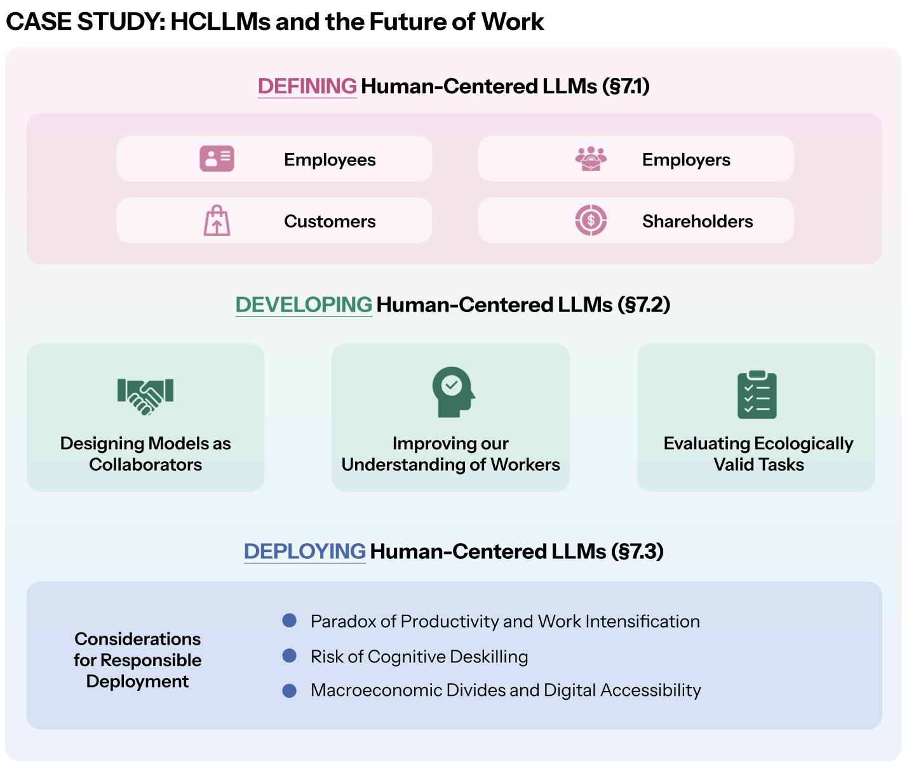

LLMs are not only research technologies that a select group of people examine, use, and probe. They have become a part of the lives of everyday users, supporting tasks ranging from assisting with coding to giving relationship advice [@tamkin2024clio; @chatterji2025people; @yang2024swe; @jimenezswe]. For example, as of September 2025, OpenAI reported that their flagship chatbot, ChatGPT, saw over 700 million weekly active users [@chatterji2025people]. So, we conclude by discussing how our considerations around the multiple facets of HCLLMs apply in real-world applications. For example, are HCLLMs practically feasible? How do HCLLMs affect individuals and what macro effects do HCLLMs have on society?

We focus this chapter on one particular application area: the future of work. Of course, this is not the only area where LLMs are used; these models have a wide scope of applications including healthcare, education, political science, and so on [@thirunavukarasu2023large; @adiguzel2023revolutionizing; @ornstein2023train]. Nonetheless, we focus on HCLLMs' impact on labor and the future of work given public interest, as evidenced by the many headlines and speculation, as well as the individual and societal level impacts that models will have in this area [@shao2025future; @acemoglu2026building].

The adoption of LLMs in the labor market has led to significant shifts in human productivity, in-demand skills, and even possible macroeconomic changes [@chen2025code; @eloundou2024gpts]. We will now show how model developers can incorporate the human-centered principles from previous sections to define, develop, and deploy HCLLMs within this evolving ecosystem. To define HCLLMs here, we will first discuss *who* the stakeholders are and how to account for these differing parties in [Defining the Stakeholders](../07-applications/01-defining-the-stakeholders). Then, we will cover HCLLM development, how we ought to be training and evaluating models for future of work purposes in [Developing HCLLMs for the Future of Work](../07-applications/02-developing-hcllms-for-the-future-of-work). Finally, in [Responsibly Deploying HCLLMs in the Workforce](../07-applications/03-responsibly-deploying-hcllms-in-the-workforce), we conclude with considerations for responsibly deploying HCLLMs, such as the potential for widening inequalities or overreliance. The road map is visualized in the figure.

**Figure.** We present a case study on HCLLMs and the future of work, covering the three key areas of defining, developing, and deploying HCLLMs. We start by identifying relevant stakeholders ([Defining the Stakeholders](../07-applications/01-defining-the-stakeholders)), then move to examining the model capabilities needed to better suit LLMs for workplace settings ([Developing HCLLMs for the Future of Work](../07-applications/02-developing-hcllms-for-the-future-of-work)), and conclude by discussing key societal considerations ([Responsibly Deploying HCLLMs in the Workforce](../07-applications/03-responsibly-deploying-hcllms-in-the-workforce)).
